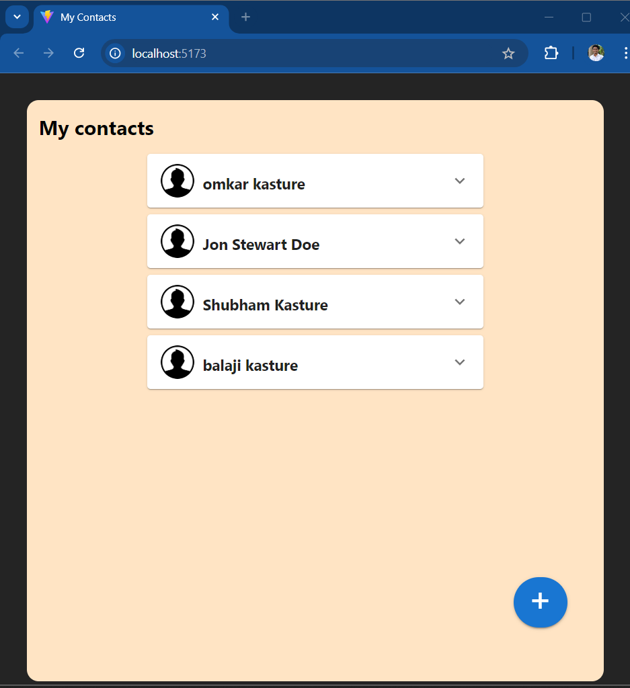
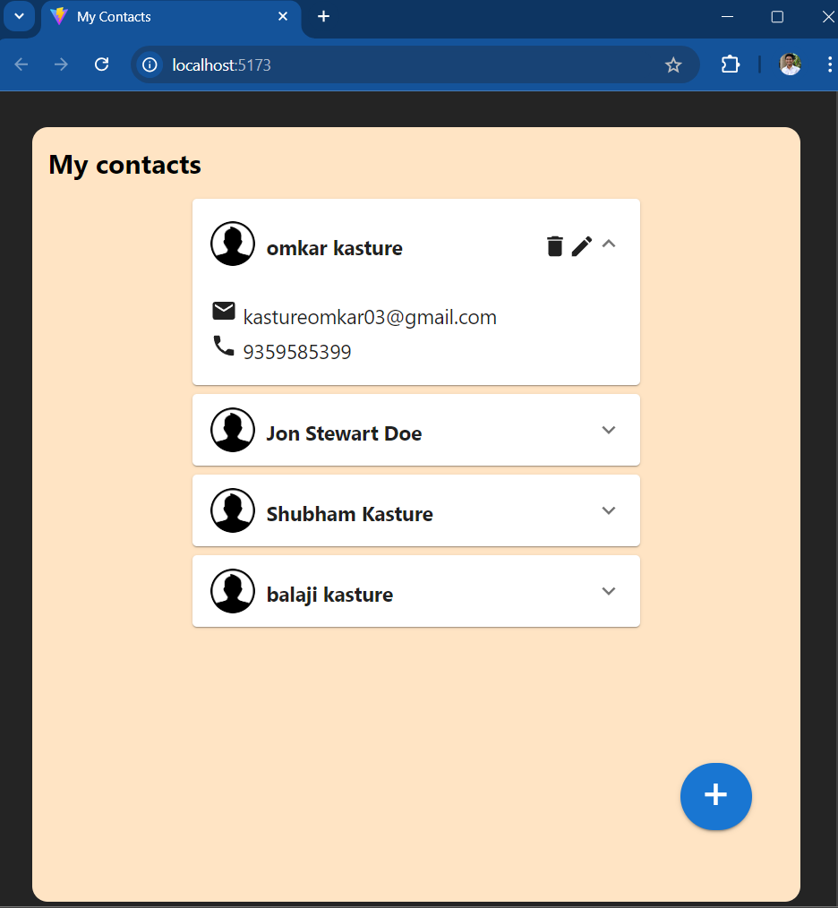
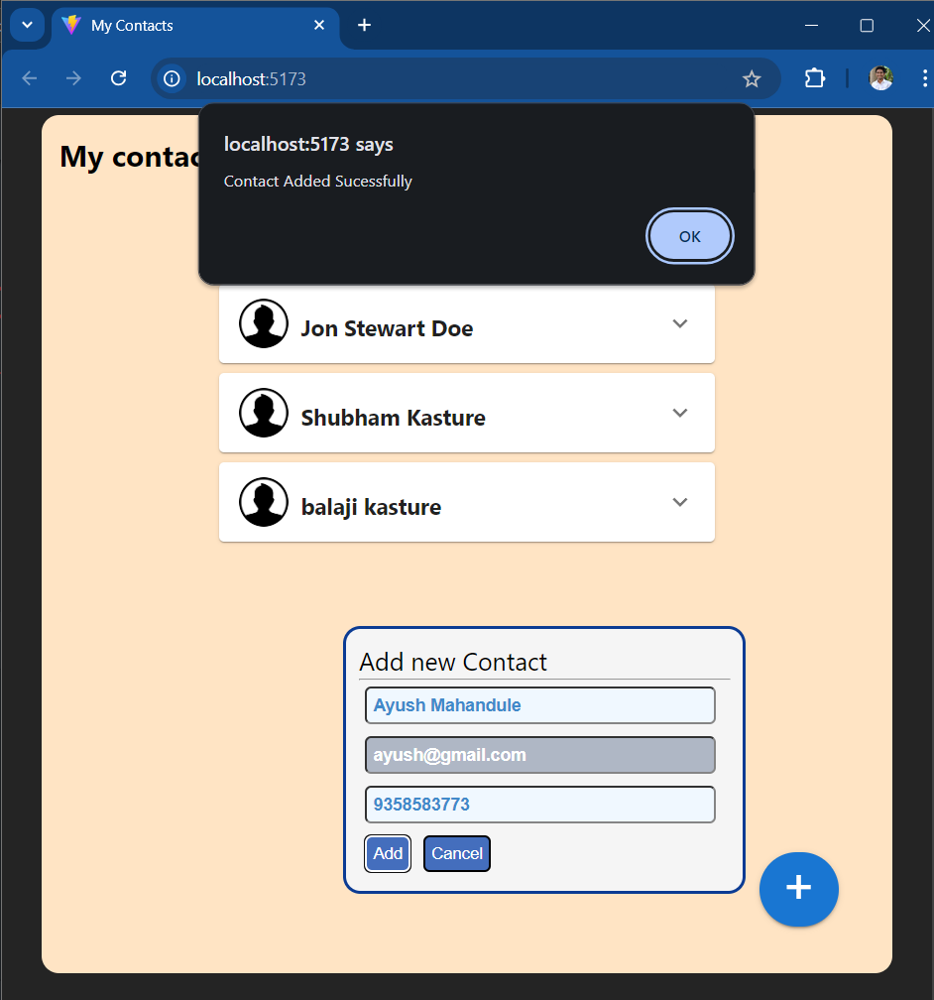
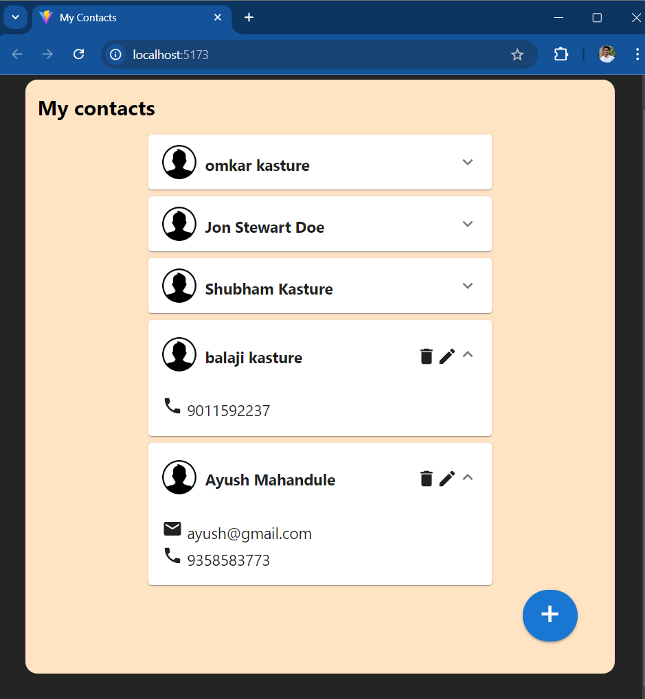
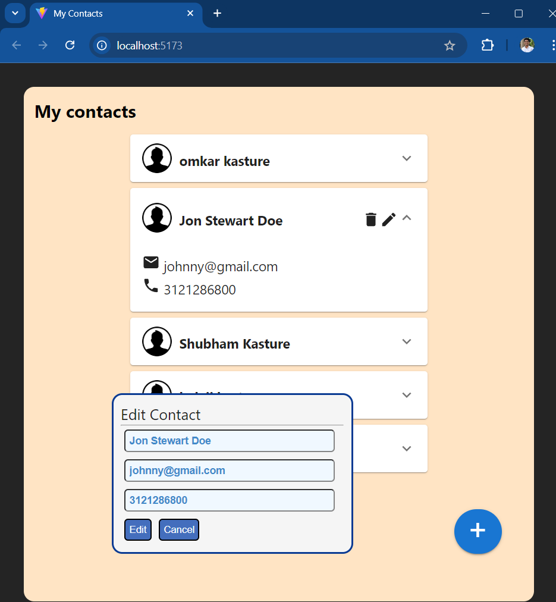

# My Contact
# Miniproject using React + express + Mysql

features
- add new contact
- edit contact
- delete contact permenantly
- display all contacts
- display each contact in detail

# implementation steps:
1. install required Packages in /backend: run >> npm install
2. create database : mycontacts or whatever you want and make required changes in db.connection
3. crerate table contact
4. run backend server in /backend>> nodemon server.js
5. run react+vite app in /frontend >> npm run dev

## ScreenShots

